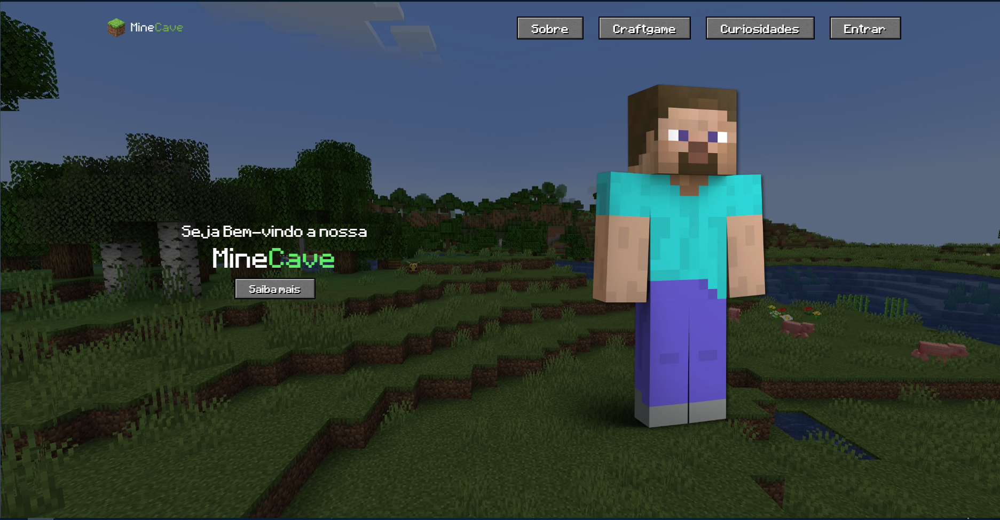
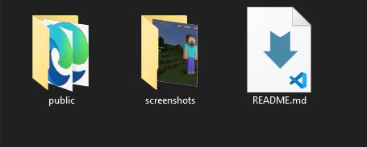
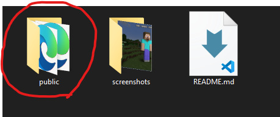
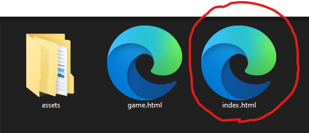

# 🧱 MineCave

**MineCave** é uma aplicação web interativa desenvolvida com HTML, CSS, JavaScript e Chart.js, inspirada no universo do Minecraft. O objetivo é criar um espaço para jogadores se conectarem, aprenderem e se divertirem com funcionalidades educativas e interativas.

## 🔥 Funcionalidades

- 🗣 **Fórum de Jogadores:** Um espaço para compartilhar experiências, dúvidas e interações entre fãs do game.
- 📖 **História do Minecraft:** Página dedicada à linha do tempo e evolução do jogo desde o seu lançamento.
- 🧪 **Desafio de Crafting Secreto:** Um minigame onde o usuário tenta adivinhar receitas de crafting ocultas.
- 📊 **Dashboard Educacional:** A principal funcionalidade do projeto. Cada usuário tem acesso a uma dashboard com progresso individual, onde pode fazer cursos sobre:
  - Redstone no Minecraft (lógica, mecanismos, automação)
  - Fundamentos de Ciências da Computação (lógica binária, algoritmos, circuitos)

## 🛠 Tecnologias Utilizadas

- **HTML5**
- **CSS3**
- **JavaScript (ES6+)**
- **[Chart.js](https://www.chartjs.org/)** – Para visualização gráfica do progresso dos cursos

## 📸 Screenshots



## 🚀 Como Executar o Projeto

1. Clone o repositório:
    ```bash
    git clone https://github.com/seu-usuario/minecave.git
    ```
2. Acesse a pasta do projeto:
    
3. Acesse a pasta do public:
    Acesse a pasta public:
    
4. Abra o Index.HTML:
    
    > *Recomenda-se o uso de uma extensão como Live Server (VS Code) ou um servidor local para evitar problemas com recursos externos (ex: Chart.js).*
